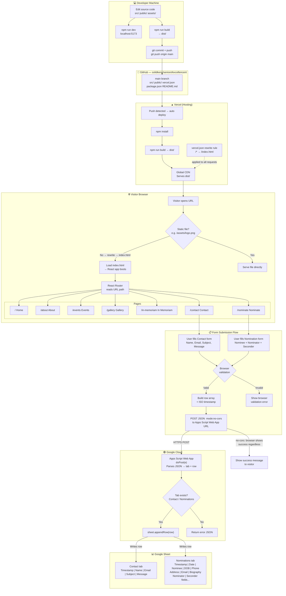

# Seniors of Excellence NT — System Architecture

End-to-end overview of the React + Vite site, Vercel hosting, and Google Sheets form backend.

## Whole-system flowchart



## Stack summary

| Layer | Technology | Role |
|-------|------------|------|
| Frontend | React 19 + Vite 6 + React Router | SPA pages and client-side routing |
| Styling | Tailwind CSS | Build-time utility classes |
| Hosting | Vercel | Builds `dist/` and serves over HTTPS |
| Source control | GitHub (`solidkenn/seniorofexcellencent`) | Triggers deploy on push to `main` |
| Form backend | Google Apps Script Web App | Receives POST, appends rows to a sheet |
| Data store | Google Sheet | Tabs: **Contact**, **Nominations** |

## Routes

| Path | Page | Layout |
|------|------|--------|
| `/` | Home | Shared (Header + Footer) |
| `/about` | About | Shared |
| `/events` | Events | Shared |
| `/gallery` | Gallery | Shared |
| `/in-memoriam` | In Memoriam | Shared |
| `/contact` | Contact | Shared |
| `/nominate` | Nomination form | Standalone (minimal header) |

## SPA routing on Vercel

`vercel.json` rewrites all non-file requests to `index.html` so refreshes on routes like `/about` work. Static assets under `/assets/` are served as files first.

## Form submission

1. User submits **Contact** or **Nominate** form.
2. `src/lib/sheetForm.js` POSTs JSON: `{ tab, row }` to the Apps Script Web App URL.
3. Apps Script (`assets/google-apps-script-reference.gs`) runs `doPost`, opens the sheet by tab name, and `appendRow(row)`.

**Contact row:** Timestamp, Name, Email, Subject, Message  

**Nominations row:** Timestamp, nomination date, nominee fields, nominator fields, seconder fields (see `src/pages/Nominate.jsx`).

### Important: `no-cors` mode

Forms use `fetch` with `mode: 'no-cors'`. The browser cannot read the response from Google, so the UI shows success after the request is sent—not after confirming the row was saved. Verify submissions in the Google Sheet after testing.

## Key files

| File | Purpose |
|------|---------|
| `src/App.jsx` | Route definitions |
| `src/lib/sheetForm.js` | Web App URL and POST helper |
| `assets/google-apps-script-reference.gs` | Apps Script template for the sheet |
| `vercel.json` | SPA rewrites for Vercel |
| `public/assets/` | Images and static files at `/assets/...` |

## Local development

```bash
npm install
npm run dev      # http://localhost:5173
npm run build    # output → dist/
```
